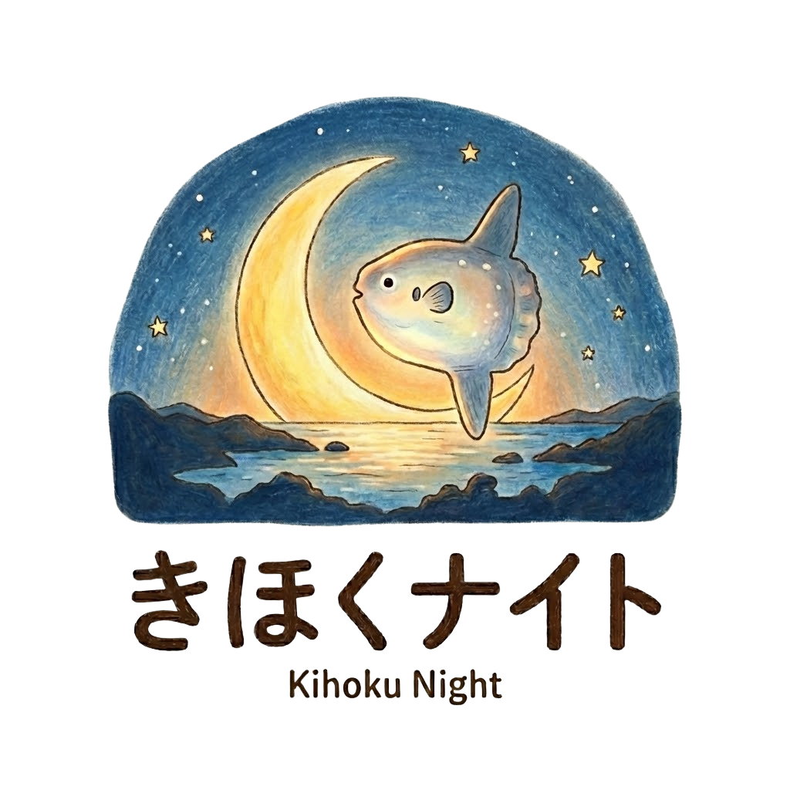

<!DOCTYPE html>
<html lang="ja">
<head>
  <meta charset="UTF-8" />
  <meta name="viewport" content="width=device-width, initial-scale=1.0" />
  <title>きほくナイト — 自分と地域をちょっと良くする、ゆるい持ち寄り会議。</title>
  
  
  
  
  <link rel="preconnect" href="https://fonts.googleapis.com" />
  <link rel="preconnect" href="https://fonts.gstatic.com" crossorigin />
  <link href="https://fonts.googleapis.com/css2?family=Noto+Serif+JP:wght@400;500;600;700&family=Noto+Sans+JP:wght@400;500;700&display=swap" rel="stylesheet" />
  
  
</head>
<body>
  

  
</body>
</html>
